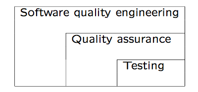

Software Quality Engineering
============================

	Testing, Quality Assurance, and Quantiable Improvement

Tian Siyuan <tiansiyuan@gmail.com>

# Chapter 1: Overview

-	 Meeting People’s Quality Expectations

-	 Book Organization/Overview/Usage

-	 Pre-requisite Knowledge

# General Expectations

-	 General expectation:

	 "good" software quality

-	 Objects of our study: software

	 -	 software products, systems, and services
	 
	 -	 stand-alone to embedded
	 
	 -	 software-intensive systems
	 
	 -	 wide variety, but focus on software

-	 Quality (and how "good") formally defined

# Quality Expectations

-	 People: Consumers vs producers

	-	quality expectations by consumers

	-	to be satisfied by producers through software quality engineering (SQE)

-	 Deliver software system

	-	does what it is supposed to do

		needs to be "validated"

	-	does the things correctly

		needs to be "verified"

	-	show/demonstrate/prove it ("does")

		modeling/analysis needed

# Meeting Quality Expectations

-	 Difficulties in achieving good quality:

	-	size: MLOC products common
	-	complexity
	-	environmental stress/constraints
	-	flexibility/adaptability expected

-	 Other difficulties/factors:

	-	product type
	
	-	cost and market conditions
	
	-	addressed later (especially Part III)

-	 "no silver bullet", but SQE (software quality engineering) helps

# SQE as an Answer

-	 Major SQE activities:

	-	Testing: remove defect & ensure quality
	
	-	Other QA alternatives to testing
	
	-	How do you know: analysis & modeling

-	 Scope and content hierarchy

	

	-	Software quality engineering

	-	Quality assurance

	-	Testing

# Contents

-	 QA alternatives/SQE activities:

-	 Overview and Basics (Part I)

-	 QA alternatives:

	-	Testing (Part II)
	-	Other alternatives (Part III)
	-	Overall comparison

-	 Analysis and improvement (Part IV)

	-	overall mechanism
	
	-	measurements/models
	
	-	specific analyses/models

-	 Testing (Part II):

	-	all topics, but focus on techniques

	-	overview and general questions

	-	important common issues

		activities/management/automation

	-	testing techniques
	
	-	specialization and integration

-	 Testing techniques

	-	organized by underlying models:

		lists and partitions
		
		finite-state machines

	-	both black-box and white-box views

	-	both coverage goals and usage/reliability goals

-	 Other alternatives (Part III):

	-	defect prevention
	
	-	inspection, review, analysis
	
	-	formal verification
	
	-	defect containment
	
	-	comparison, including testing

-	 Comparing different QA alternative

	-	applicability and effectiveness
	
	-	dealing with quality problems/defects:

		prevention/removal/tolerance

	-	cost
	
	-	overall comparison

# Pre-requisite

-	 Math/statistics:

	-	discrete math, logic, graph, etc.
	
	-	probability and statistics

	-	used in modeling/analysis.

-	 Background knowledge in CS/SE:

	-	computer systems and programming

	-	fundamentals of computing

	-	general SE knowledge and experience